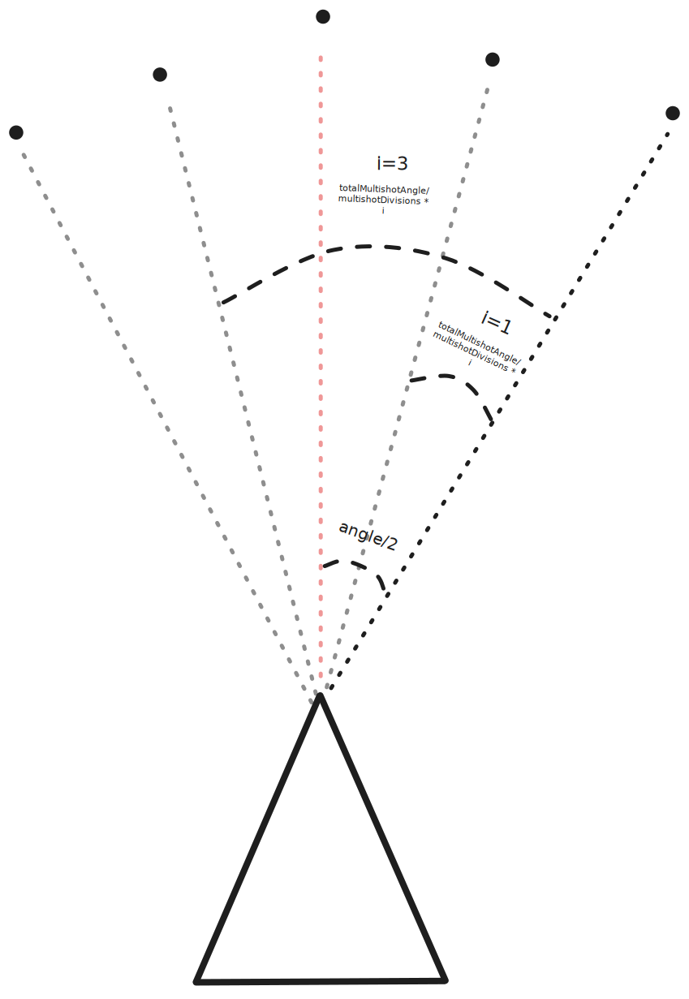
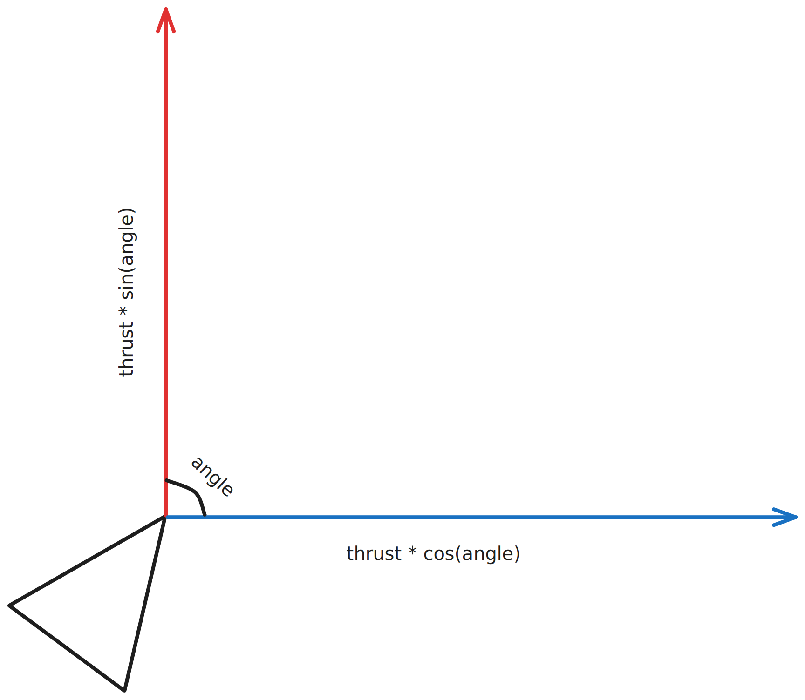
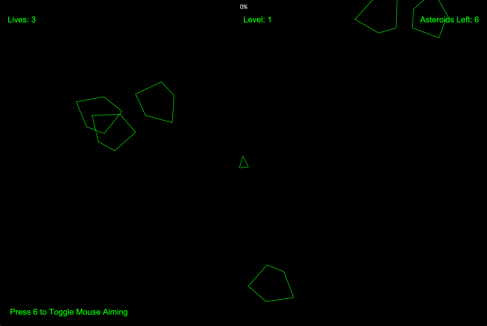
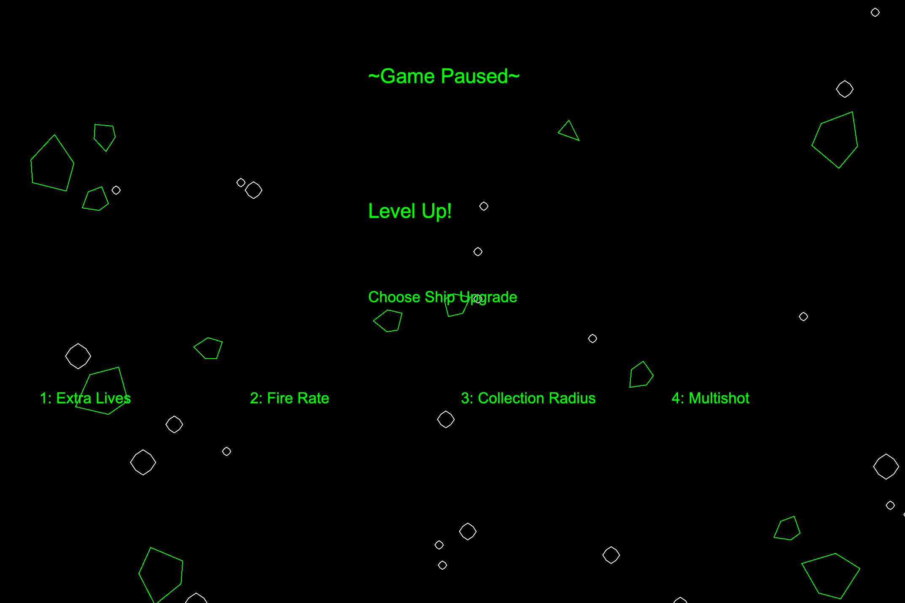

# Asteroids

This project is a recreation (with some personal additions) of the original Atari game _Asteroids_ released in 1979.

## Key Features:

### Multishot

I first defined `totalMultishotAngle` as the range that the multishot bullets were to be fired and dispersed at, and `multishotLevel` as, well, the multishot level.

I then define `multishotDivisions` as `2 + multishotLevel * 2`. The "2+" is to have a base multishot level and each multishot level adds two more bullets (to balance on each side), thus times 2.

Then, I iterate through multishot divisions (`i <= multishotDivisions`) and use this formula to calculate the angle:

```
rotatedAngle = angle + totalMultishotAngle/2 - (totalMultishotAngle/multishotDivisions * i)
```

This diagram explains what is happening in the formula:


### Movement and Rotation

#### Logic:
I used trigonometry to calculate the X and Y speeds depending on a angle value and a "thrust" value.


#### Rendering:
I used the rotation matrix to rotate the points making up the shape of the ship, which is then rendered.

$$
\begin{bmatrix}
\cos(\theta) & -\sin(\theta) \\
\sin(\theta) & \cos(\theta)  \\ 
\end{bmatrix}
$$

This can be expressed in (pseudo) code as:

```
rotatedX = x * cos(angle) - y * sin(angle);
rotatedY = x * sin(angle) + y * cos(angle);
```


## Key Concepts:
- Trigonometry
- Interfaces
- Object-Oriented Programming
- Matrices

## Pictures:



